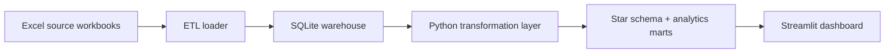

# My Own BI System

A practical local BI stack for building a Ghana RTD player intelligence dashboard from Excel source files.

## What This Includes

- `etl/`: extract/load scripts that land Excel data in SQLite.
- `warehouse/`: local SQLite database storage.
- `etl/run_models.py`: transformation layer that builds the analytical star schema.
- `assets/right_to_dream_logo.png`: project-local logo asset used by the dashboard.
- `dashboard/`: Streamlit app for visual analysis.
- `docs/`: architecture notes and operating playbooks.

For a portable client package, place source workbooks in `data/sources/`. During local development, the app can also fall back to:

- `/Users/MussaYousef/Downloads/RTD NAMEs/Black_Queens (2).xlsx`
- `/Users/MussaYousef/Downloads/RTD NAMEs/Ghana Heatmap (2).xlsx`
- `/Users/MussaYousef/Downloads/RTD NAMEs/Ghana_RTD_Players (3).xlsx`
- `/Users/MussaYousef/Downloads/RTD NAMEs/Squad_Movement (2).xlsx`

## Architecture



## Quick Start

1. Create a virtual environment:

   ```bash
   python3 -m venv .venv
   source .venv/bin/activate
   ```

2. Install dependencies:

   ```bash
   pip install -r requirements.txt
   ```

3. Load Excel data into the warehouse:

   ```bash
   python -m etl.load_raw
   ```

4. Build analytics tables:

   ```bash
   python -m etl.run_models
   ```

5. Start the dashboard:

   ```bash
   streamlit run dashboard/app.py
   ```

## Package For Client Delivery

Create a clean ZIP package:

```bash
python -m scripts.package_mvp
```

Include the Excel source files only if you are allowed to share them:

```bash
python -m scripts.package_mvp --include-sources
```

The ZIP appears in `dist/`.

## Python Version

Use Python 3.11 for this project. Python 3.14 is currently too new for some analytics packages and may try to build dependencies from source.

## Suggested Build Path

1. Load the four RTD workbooks exactly as received into raw tables.
2. Clean and standardize players, geography, Black Queens, and movement data in the Python transformation layer.
3. Publish trusted mart tables for dashboards.
4. Add tests for row counts, uniqueness, missing locations, and duplicate player names.
5. Automate refresh once the manual flow is trusted.

## Production Upgrade Path

When the local system proves useful, the components can evolve like this:

- SQLite -> Postgres, BigQuery, Snowflake, or ClickHouse.
- Python scripts -> Airflow, Dagster, Prefect, or scheduled jobs.
- Python transformation layer -> dbt project or a managed orchestration pipeline.
- Streamlit -> Metabase, Superset, Power BI, Tableau, or a custom React dashboard.
- Local files -> APIs, databases, S3-compatible object storage, or SaaS connectors.
