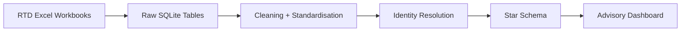

# Right To Dream Talent Intelligence Methodology

## Product Identity

RIGHT TO DREAM TALENT INTELLIGENCE

Recruitment, Development & Pathway Intelligence

The product is designed to support academy leadership, recruitment, scouting, coaching, and analysis workflows. It distinguishes:

- FACT: what the data shows.
- INTERPRETATION: why it may matter.
- RECOMMENDATION: what could be investigated next.

## Analytical Architecture

## Source Tables

- `raw_ghana_rtd_players`: primary player master source.
- `raw_ghana_heatmap`: player origin and location source.
- `raw_squad_movement`: longitudinal squad observations.
- `raw_black_queens`: women's football reference landscape, not assumed RTD outcomes.

## Star Schema

- `dim_player`: one row per academy player with `player_id`, normalised identity, demographics, recruitment origin, ratings, pathway, development metrics, and data quality.
- `fact_squad_movement`: one row per player observation date, including previous squad, next squad, squad level change, movement type, and match confidence.
- `dim_squad`: squad hierarchy and outcome categories.
- `dim_date`: calendar and academic-year attributes.
- `dim_geography`: standardised player-origin geography.
- `mart_source_effectiveness`: source-level recruitment effectiveness by region, town, entry club, and nationality.
- `mart_dashboard_summary`: executive metrics.
- `mart_region_concentration`: geographic concentration and recruitment share.
- `mart_black_queens`: reference landscape for senior women's football.

## Cleaning Logic

- Standardise case and whitespace.
- Normalise names by lowercasing, removing accents, punctuation, duplicate spaces, and hyphen differences.
- Standardise known region variants such as `Northen Region` to `Northern Region`.
- Preserve missing values as missing. Missing does not mean zero.
- Flag suspicious records, including invalid entry ages and date-like position values.

## Player Identity Resolution

Current implemented matching hierarchy:

- Level 1: exact normalised name + DOB.
- Level 2: exact normalised name.
- Unmatched movement records are retained and marked for manual review.

Fields created:

- `player_id`
- `player_name_normalised`
- `match_method`
- `match_score`
- `match_confidence`
- `manual_review_required`

Future enhancement: add fuzzy matching with manual approval queues for scores below the safe threshold.

## Data Quality Score

Each player receives a score based on completeness of:

- DOB
- Entry date
- Entry age
- Entry club
- Hometown
- Region
- Coordinates
- Football rating
- Academic rating
- IDP progress
- Pathway
- Squad
- Market value
- Squad movement history

Classification:

- `GOOD`
- `PARTIAL`
- `POOR`
- `REVIEW REQUIRED`

`REVIEW REQUIRED` is used when potentially invalid or conflicting fields are detected.

## Squad Hierarchy

Initial squad levels:

- Foundation Squad = 1
- Junior Squad = 2
- Development Squad = 3
- Transition Squad = 4
- Advanced Squad = 5
- IA Squad = 6
- First Team = 7
- RTD Pro, External Pros, US Students = outcome states

Girls Squad is treated separately and should not be forced into the male pathway hierarchy without further domain review.

## Recruitment Success Index

The initial RSI is configurable and directional:

- 30% squad progression
- 25% football rating
- 20% development velocity
- 15% pathway outcome
- 10% market value percentile

This is not a "talent score" and should not be treated as objective truth.

## Evidence Strength

Evidence strength considers sample size and data completeness:

- `STRONG`
- `MODERATE`
- `WEAK`
- `INSUFFICIENT`

Recommendations should not be made from insufficient evidence.

## Analytical Safeguards

- Correlation is not causation.
- Missing is not zero.
- Recruitment absence is not talent absence.
- Small samples require warning.
- Player development labels must be careful and developmental.
- Automated advice supports professional judgement; it does not replace it.

## Brand Palette

The app uses the supplied Right to Dream logo asset at `assets/right_to_dream_logo.png`.

Extracted visible-pixel brand palette:

- Primary logo green: `#10a068`
- Secondary green variants: `#10a868`, `#10a870`, `#08a068`
- Logo black: `#000000`
- Logo white: `#f8f8f8`

Applied dashboard palette:

- Background: `#050706`
- Surface: `#0b1512`
- Secondary surface: `#10231d`
- Primary brand: `#10a068`
- Secondary accent: `#f8f8f8`
- Positive: `#5fe38b`
- Watch: `#ffbf47`
- Risk: `#ff6b6b`
- Text: `#f8f8f8`
- Muted text: `#aab8b1`
